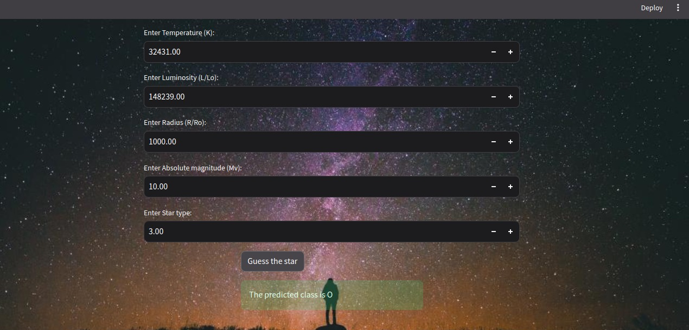

# Stellar website

This is a simple website using the Streamlit framework, to test a machine learning model that classifies stars. 



## Usage

1) Fork or clone this repository
2) Install requirements:
```
pip install -r requirements.txt
```
3) Run the app:
```
streamlit run app.py
```

### Docker

To build an image locally, make sure you have docker installed in your computer and run the following command:

```
docker build -t my_app:latest .
```

You can replace `my_app` by any image name you would like and `latest` by any version.

Then you can run your app by running

```
docker run -p 8501:8501 my_app:latest
```

## Additional note

This small project was constructed based on a streamlit template made by `bruscalia`. You can check it out on 
`https://github.com/bruscalia/optimization-app`


